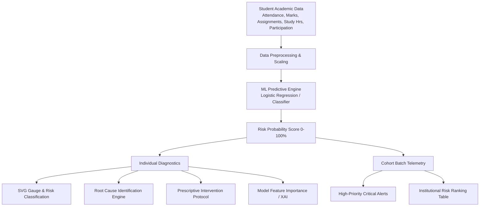

# 🎓 AI Dropout Risk Intelligence System

[](https://www.python.org/)
[](https://streamlit.io/)
[](https://scikit-learn.org/)
[](https://opensource.org/licenses/MIT)
[]()

> **An end-to-end Explainable AI (XAI) and predictive analytics platform designed for educational institutions to proactively identify student dropout risks, diagnose underlying root causes, and trigger early, prescriptive intervention protocols.**

---

## 📌 Overview

Student retention is a critical challenge for educational institutions worldwide. Traditional monitoring often flags academic distress when it is already too late. 

**AI Dropout Risk Intelligence** bridges this gap by combining machine learning risk modeling, real-time risk gauge telemetry, model explainability, and automated institutional alerts into a centralized Streamlit dashboard.

---

## ✨ Key Features

### 🧠 1. Individual Student Risk Intelligence
* **Multivariate Risk Scoring**: Evaluates attendance, assignment completion rates, test scores, study hours, and classroom participation.
* **Dynamic Circular SVG Gauge**: Visual risk meter with real-time probability categorization (**Low**, **Medium**, **High / Critical Risk**).
* **AI Root-Cause Diagnostic Engine**: Automatically identifies the **Primary** and **Secondary** risk drivers (e.g., critical attendance deficit vs. assignment lag).
* **Actionable Prescriptive Interventions**: Recommends personalized recovery protocols (e.g., immediate faculty counseling, dedicated mentorship, structured review cycles).
* **Model Explainability (XAI)**: Visualizes feature importance coefficients to maintain transparency in AI-driven decision-making.

### 📊 2. Institutional Batch Monitoring & Early Warning System
* **Cohort-Level Risk Dashboard**: High-throughput risk ranking across student bodies or specific departments.
* **🚨 Real-Time Critical Alerting**: Simulates advisory notification triggers when students cross critical danger thresholds.
* **Department & Semester Filtering**: Tailored analytics for academic deans, advisors, and mentors.

### 🎨 3. Modern Aesthetic UI / UX
* **Dual Theme Engine**: Seamless toggle between Sleek Dark Mode and Clean Light Mode.
* **Glassmorphism & Responsive Cards**: Fluid, high-contrast visual design built with custom CSS and embedded SVG telemetry.

---

## 🏗️ System Architecture



---

## 🛠️ Tech Stack

| Domain | Technology |
|---|---|
| **Language** | Python 3.9+ |
| **Frontend / Dashboard** | [Streamlit](https://streamlit.io/), HTML5, Custom CSS3, SVG Components |
| **Machine Learning** | [Scikit-learn](https://scikit-learn.org/) (Logistic Regression, Classification Metrics) |
| **Data Processing** | [Pandas](https://pandas.pydata.org/), [NumPy](https://numpy.org/) |
| **Serialization** | Pickle |

---

## 📂 Project Structure

```bash
AI_Dropout_Risk_Intelligence/
├── app.py                # Main Streamlit web application & UI
├── train_model.py        # Model training, synthetic dataset pipeline & serialization
├── model.pkl             # Serialized trained machine learning model
├── requirements.txt      # Project dependencies
├── README.md             # Project documentation
└── .gitignore            # Git ignore file
```

---

## 🚀 Quick Start Guide

### 1. Clone the Repository
```bash
git clone https://github.com/YOUR_USERNAME/AI_Dropout_Risk_Intelligence.git
cd AI_Dropout_Risk_Intelligence
```

### 2. Create and Activate a Virtual Environment
```bash
# macOS/Linux
python3 -m venv venv
source venv/bin/activate

# Windows
python -m venv venv
venv\Scripts\activate
```

### 3. Install Dependencies
```bash
pip install -r requirements.txt
```

### 4. Train the Model (Optional / Initial Setup)
```bash
python train_model.py
```
> *This generates `model.pkl` with baseline training metrics (Accuracy score & Confusion Matrix).*

### 5. Launch the Streamlit Dashboard
```bash
streamlit run app.py
```
*Open `http://localhost:8501` in your browser to access the application.*

---

## 📊 Feature Importance & Academic Indicators

| Indicator | Description | Impact on Risk |
|---|---|---|
| **Attendance (%)** | Class attendance percentage | 🔴 High Inverse Correlation |
| **Marks (%)** | Academic assessment & exam scores | 🔴 High Inverse Correlation |
| **Assignments (%)** | Timely completion rate of coursework | 🟡 Moderate Inverse Correlation |
| **Study Hours (hrs/wk)** | Self-study and lab prep hours | 🟢 Moderate Inverse Correlation |
| **Participation (1-10)** | Active engagement in class activities | 🟢 Engagement Factor |

---

## 🔮 Future Enhancements
- [ ] Integration with Campus Learning Management Systems (Canvas, Moodle, Blackboard).
- [ ] Implementation of Advanced Ensemble Models (XGBoost, LightGBM, Random Forest) with SHAP value visualizations.
- [ ] Automated Email/SMS dispatch directly to student advisors and mentors.
- [ ] Historical trend tracking over multi-semester trajectories.

---

## 🤝 Contributing

Contributions, issues, and feature requests are welcome!
1. Fork the Project
2. Create your Feature Branch (`git checkout -b feature/AmazingFeature`)
3. Commit your Changes (`git commit -m 'Add some AmazingFeature'`)
4. Push to the Branch (`git push origin feature/AmazingFeature`)
5. Open a Pull Request

---

## 📄 License

Distributed under the **MIT License**. See `LICENSE` for more information.

---

## 👨‍💻 Author

**Ishant Khandelwal**
- GitHub: [@YOUR_GITHUB_USERNAME](https://github.com/YOUR_GITHUB_USERNAME)
- LinkedIn: [Ishant Khandelwal](https://www.linkedin.com/in/YOUR_LINKEDIN_USERNAME)
